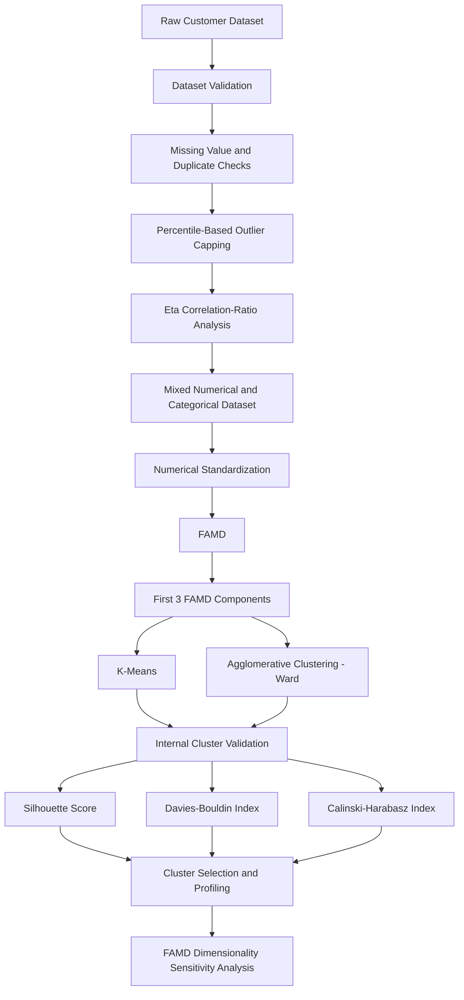
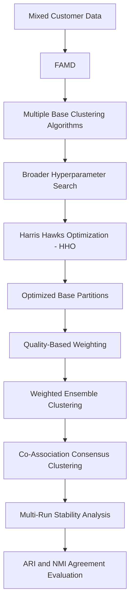

# Baseline Article Replication — Customer Segmentation with FAMD and Clustering


## Overview

This project contains a **clean, executable, and reproducible implementation of the baseline article used in my thesis on customer segmentation**.

The purpose of this implementation is to establish a transparent baseline against which the proposed thesis methodology can be compared.

The baseline applies an **unsupervised machine-learning pipeline** to mixed-type e-commerce customer data containing both numerical and categorical variables. The workflow combines data validation, preprocessing, **Factor Analysis of Mixed Data (FAMD)**, K-Means clustering, Agglomerative Hierarchical Clustering, internal clustering validation, customer-segment profiling, and dimensionality-sensitivity analysis.

The implementation has been organized so that the complete experiment can be executed sequentially and its principal tables, figures, metadata, and intermediate results can be reproduced.

---

## Research Objective

Customer segmentation aims to identify groups of customers whose members exhibit similar demographic, behavioural, purchasing, or preference-related characteristics.

A major challenge in this dataset is that the customer attributes contain a mixture of:

- Numerical variables
- Categorical variables

To represent these heterogeneous variables in a common analytical space, the baseline methodology uses:

> **Factor Analysis of Mixed Data (FAMD)**

FAMD transforms the mixed numerical and categorical feature space into numerical latent components that can subsequently be analyzed using clustering algorithms.

The baseline implementation then evaluates two clustering approaches:

1. **K-Means Clustering**
2. **Agglomerative Hierarchical Clustering with Ward Linkage**

The principal baseline comparison considers:

```text
k = 3
k = 4
```

A broader K-Means sweep from `k = 2` to `k = 10` is also performed as an additional diagnostic analysis.

---

## Baseline Workflow

The complete baseline pipeline is:



The implementation also automatically generates diagnostic figures, cluster profiles, experiment summaries, and reproducibility metadata.

---

## Dataset

The project uses the publicly available:

### Shopping Trends and Customer Behaviour Dataset

The dataset is available from Kaggle:

[Download the Shopping Trends and Customer Behaviour Dataset](https://www.kaggle.com/datasets/sahilislam007/shopping-trends-and-customer-behaviour-dataset)

The dataset contains customer demographic, behavioural, purchasing, and preference-related information.

### Dataset Summary

| Property | Value |
|---|---:|
| Number of customers | **3,900** |
| Original columns | **17** |
| Modelling features after ID removal | **16** |
| Numerical variables | **4** |
| Categorical variables | **12** |
| Missing values | **0** |
| Duplicate rows | **0** |
| Duplicate Customer IDs | **0** |

`Customer ID` is excluded from modelling because it acts as an identifier rather than a behavioural or descriptive customer feature.

> **Note:** The dataset is not redistributed through this repository. Users should download it from the original Kaggle source.

---

## Data Validation

Before any modelling stage, the implementation performs systematic sanity checks.

These checks include:

- Dataset dimensions
- Column names
- Numerical and categorical data types
- Missing values
- Duplicate rows
- Duplicate customer identifiers
- Numerical conversion errors
- Categorical cardinalities

The current execution confirms:

```text
Observations             = 3,900
Original columns         = 17
Missing values           = 0
Duplicate rows           = 0
Duplicate Customer IDs   = 0
```

These checks ensure that the clustering pipeline begins from a consistent and auditable dataset.

---

## Percentile-Based Outlier Capping

Following the baseline methodology, percentile capping is applied specifically to:

- `Purchase Amount (USD)`
- `Previous Purchases`

The capping boundaries are defined as:

```text
Lower bound = 5th percentile
Upper bound = 95th percentile
```

The current execution produces:

| Feature | Lower Cap | Upper Cap |
|---|---:|---:|
| Purchase Amount (USD) | **23.00** | **96.05** |
| Previous Purchases | **3.00** | **48.00** |

`Age` and `Review Rating` are intentionally not capped in this baseline replication.

The objective of percentile capping is to reduce the influence of extreme observations while retaining all customer records in the analysis.

---

## Eta Correlation-Ratio Analysis

Because several explanatory variables are categorical, the implementation calculates the **Eta correlation ratio** between categorical features and:

```text
Purchase Amount (USD)
```

A reference threshold of:

```text
η = 0.03
```

is included in the analysis.

Examples from the current execution include:

| Categorical Feature | Eta |
|---|---:|
| Location | **0.125663** |
| Color | **0.095080** |
| Item Purchased | **0.070691** |
| Season | **0.053275** |
| Shipping Type | **0.038847** |
| Category | **0.034071** |

### Important Methodological Note

Eta is used here as a:

> **diagnostic and reporting measure**

It is **not used as an automatic feature-elimination rule**.

Variables whose Eta values fall below the reference threshold are therefore not automatically removed. This preserves the feature structure of the baseline replication.

---

## One-Hot Encoding Diagnostic Representation

A one-hot encoded representation is generated for diagnostic and reporting purposes.

The expanded representation contains:

| Representation | Number of Features |
|---|---:|
| Standardized numerical features | **4** |
| Dummy variables | **135** |
| Total expanded features | **139** |

Some of the higher-cardinality categorical variables include:

| Feature | Categories |
|---|---:|
| Location | 50 |
| Item Purchased | 25 |
| Color | 25 |
| Frequency of Purchases | 7 |
| Shipping Type | 6 |
| Payment Method | 6 |
| Category | 4 |
| Season | 4 |

### Important Distinction

The one-hot encoded matrix is **not used as the input to FAMD** in the cleaned implementation.

It is retained only for:

- Preprocessing transparency
- Feature-dimensionality reporting
- Categorical-cardinality inspection

The actual dimensionality-reduction pipeline is:

```text
Mixed Numerical + Categorical Data
                │
                ▼
               FAMD
```

This preserves the intended role of FAMD as a method specifically designed for mixed-type data.

---

## Factor Analysis of Mixed Data — FAMD

FAMD is used to transform the mixed customer dataset into a common numerical representation suitable for clustering.

Before fitting FAMD:

- Numerical variables are converted to numeric form
- Numerical missing values, if present, can be median-imputed
- Numerical variables are standardized
- Categorical variables remain categorical
- The complete mixed-data table is supplied directly to FAMD

The principal baseline experiment uses:

```text
3 FAMD components
```

The resulting clustering representation therefore has the shape:

```text
3,900 × 3
```

---

## FAMD Explained Inertia

The first three FAMD components produce the following reported inertia values:

| Component | Reported Explained Inertia |
|---|---:|
| Component 1 | **2.490248%** |
| Component 2 | **1.641312%** |
| Component 3 | **1.623720%** |
| **Cumulative** | **5.755280%** |

The relatively low cumulative reported inertia of the first three components is explicitly acknowledged as a methodological consideration.

Rather than ignoring this issue, the implementation includes a separate **FAMD dimensionality-sensitivity analysis** to investigate whether using additional components improves clustering quality.

---

## Baseline Clustering Algorithms

### K-Means Clustering

K-Means is a centroid-based clustering algorithm that attempts to minimize within-cluster squared distances.

For reproducibility, the baseline implementation uses:

```python
RANDOM_STATE = 42
n_init = 10
```

The main candidate solutions are:

```text
k = 3
k = 4
```

A broader range from `k = 2` to `k = 10` is additionally evaluated for elbow and Silhouette diagnostics.

---

### Agglomerative Hierarchical Clustering

Agglomerative clustering follows a bottom-up hierarchical procedure in which observations begin as separate units and are progressively merged into clusters.

The baseline implementation uses:

```text
Ward linkage
```

Ward linkage attempts to minimize the increase in within-cluster variance during each merging step.

The primary candidate solutions are again:

```text
k = 3
k = 4
```

---

## Clustering Evaluation Metrics

Because the dataset does not contain known ground-truth customer-segment labels, clustering quality is evaluated using **internal validation metrics**.

Three complementary metrics are used.

### Silhouette Score

Measures both:

- Within-cluster cohesion
- Between-cluster separation

Interpretation:

```text
Higher = Better
```

### Davies-Bouldin Index — DBI

Evaluates cluster similarity using within-cluster dispersion and between-cluster separation.

Interpretation:

```text
Lower = Better
```

### Calinski-Harabasz Index — CHI

Compares between-cluster dispersion with within-cluster dispersion.

Interpretation:

```text
Higher = Better
```

Using all three metrics provides a more balanced assessment than relying on a single clustering-quality measure.

---

## Main Baseline Results

The principal baseline comparison produces the following results:

| Algorithm | k | Silhouette | DBI | CHI |
|---|---:|---:|---:|---:|
| Agglomerative (Ward) | 3 | 0.485864 | 1.073681 | 2639.60 |
| K-Means | 3 | 0.491070 | 0.891033 | 2475.73 |
| Agglomerative (Ward) | **4** | **0.564877** | **0.737173** | **3596.45** |
| K-Means | **4** | **0.564877** | **0.737173** | **3596.45** |

Within the baseline comparison of:

```text
k = 3
vs.
k = 4
```

the four-cluster solution produces:

- A higher Silhouette Score
- A lower Davies-Bouldin Index
- A higher Calinski-Harabasz Index

than the corresponding three-cluster alternatives.

### Interpretation

These results support the `k = 4` solution **within the candidate comparison defined by the baseline methodology**.

They should not be interpreted as evidence that four clusters are universally optimal across every possible cluster number or modelling configuration.

---

## Broader K-Means Diagnostic Sweep

For additional diagnostic analysis, K-Means is evaluated from:

```text
k = 2
to
k = 10
```

The resulting Silhouette Scores are:

| k | Silhouette |
|---:|---:|
| 2 | 0.430180 |
| 3 | 0.491070 |
| 4 | 0.564877 |
| 5 | 0.573246 |
| 6 | 0.620926 |
| 7 | 0.656794 |
| 8 | **0.682450** |
| 9 | 0.641280 |
| 10 | 0.628413 |

This broader sweep is included as a **diagnostic extension**.

It does not replace the primary baseline comparison of `k = 3` and `k = 4`, which is retained to maintain methodological consistency with the baseline experiment used in the thesis.

---

## Four-Cluster Baseline Structure

For the selected Agglomerative Ward `k = 4` partition used for customer profiling, the cluster sizes are:

| Cluster | Number of Customers |
|---|---:|
| Cluster 0 | **1,703** |
| Cluster 1 | **599** |
| Cluster 2 | **1,274** |
| Cluster 3 | **324** |
| **Total** | **3,900** |

Every observation is assigned to one of the four baseline customer segments.

---

## Customer Segment Profiling

The implementation includes a dedicated profiling stage for the selected baseline partition.

### Numerical Profiling

For every cluster, the following numerical variables are summarized:

- Age
- Purchase Amount (USD)
- Review Rating
- Previous Purchases

Cluster means are used to characterize differences between customer groups.

### Categorical Profiling

Categorical variables are summarized using:

```text
Most frequent category
+
Percentage share of the dominant category
```

The categorical profile includes variables such as:

- Gender
- Item Purchased
- Category
- Location
- Color
- Season
- Subscription Status
- Shipping Type
- Discount Applied
- Promo Code Used
- Payment Method
- Frequency of Purchases

A normalized numerical heatmap is also generated to make differences among the customer segments easier to visualize.

---

## Visual Diagnostics

The notebook automatically produces a collection of diagnostic and analytical figures, including:

- K-Means elbow curve
- K-Means Silhouette-by-k chart
- Ward hierarchical dendrogram
- K-Means cluster visualizations
- Agglomerative cluster visualizations
- Silhouette comparison chart
- Davies-Bouldin comparison chart
- Calinski-Harabasz comparison chart
- Categorical-cardinality chart
- Feature-composition chart
- Numerical customer-profile heatmap
- FAMD dimensionality-sensitivity chart

The dendrogram uses a reproducible sample of the dataset to improve readability while maintaining deterministic behaviour.

---

## FAMD Dimensionality Sensitivity Analysis

Because the first three FAMD components account for a relatively limited proportion of the reported inertia, a supplementary experiment investigates whether additional FAMD dimensions improve clustering quality.

The effective tested dimensionalities are:

```text
3
5
8
10
12
15
16
```

For example, the K-Means `k = 4` Silhouette Scores are:

| FAMD Components | Silhouette |
|---:|---:|
| **3** | **0.564877** |
| 5 | 0.409783 |
| 8 | 0.272311 |
| 10 | 0.227092 |
| 12 | 0.198591 |
| 15 | 0.162167 |
| 16 | 0.153445 |

For this dataset and baseline clustering configuration, increasing the number of FAMD components did **not** improve the internal clustering quality.

Among the tested dimensionalities, the three-component representation produced the strongest Silhouette result for the `k = 4` baseline experiment.

### Important

This sensitivity experiment is supplementary.

It does **not overwrite, redefine, or retroactively alter** the original three-component baseline analysis.

---

## Reproducibility

The implementation was designed to make the baseline experiment reproducible and auditable.

A deterministic random state is used wherever applicable:

```python
RANDOM_STATE = 42
```

The notebook records important experimental information including:

- Dataset dimensions
- Dataset path source
- Preprocessing settings
- Percentile-capping thresholds
- Eta reference threshold
- Number of FAMD components
- Candidate cluster numbers
- Random state
- Python version
- Operating system
- Execution timestamp
- Generated output files

Each execution creates a separate timestamped output directory:

```text
outputs/
└── baseline_replication/
    └── YYYYMMDD_HHMMSS/
```

This prevents the results of separate experimental runs from being overwritten.

---

## Automatic Output Generation

The notebook automatically exports a wide range of research artifacts.

### Dataset and Validation Outputs

- Dataset schema
- Missing-value information
- Duplicate checks
- Numerical-conversion checks
- Sanity-check metadata

### Preprocessing Outputs

- Percentile-capping report
- Eta correlation-ratio report
- Eta metadata
- Categorical-cardinality report
- One-hot encoding summary

### FAMD Outputs

- FAMD coordinates
- Explained-inertia information
- FAMD metadata
- FAMD dimensionality-sensitivity results

### Clustering Outputs

- K-Means diagnostic sweep
- Candidate cluster assignments
- Cluster sizes
- Silhouette results
- Davies-Bouldin results
- Calinski-Harabasz results
- Baseline comparison tables

### Customer-Profiling Outputs

- Number of customers per cluster
- Numerical cluster means
- Normalized numerical profiles
- Categorical modes
- Dominant-category shares

### Figures

- Elbow curve
- Silhouette diagnostic
- Ward dendrogram
- Cluster visualizations
- Internal-validation charts
- Customer-profile heatmap
- FAMD sensitivity chart

A final run summary and generated-file manifest are also produced automatically.

---

## Methodological Considerations

This repository represents a **baseline-method replication used for thesis comparison**.

Its results should therefore be interpreted within that methodological scope.

Important considerations include:

1. **The dataset is unlabeled.**  
   There are no known ground-truth customer segments. Therefore, clustering performance is assessed using internal validation measures rather than classification accuracy.

2. **The primary baseline comparison is restricted to `k = 3` and `k = 4`.**  
   The broader K-Means sweep is a diagnostic extension rather than a redefinition of the baseline experiment.

3. **The first three FAMD components retain a limited proportion of the reported total inertia.**  
   This limitation is explicitly investigated through the supplementary dimensionality-sensitivity experiment.

4. **Internal validation metrics measure mathematical cluster compactness and separation.**  
   Strong internal scores do not independently prove that the identified segments correspond to unique real-world behavioural populations.

5. **The results depend on the complete analytical configuration.**  
   This includes the dataset, preprocessing rules, dimensionality reduction, clustering algorithms, candidate cluster numbers, and evaluation criteria.

These considerations are documented to keep the baseline analysis transparent rather than presenting the clustering results without qualification.

---

## Relationship to the Proposed Thesis Methodology

This implementation represents the **baseline article component** of my thesis research.

It is intentionally maintained separately from the proposed thesis implementation so that the methodological differences between the baseline and the proposed approach remain clear.

The baseline methodology can be summarized as:

```text
Mixed Customer Data
        │
        ▼
       FAMD
        │
        ▼
 ┌──────┴──────┐
 ▼             ▼
K-Means    Agglomerative
        │
        ▼
Internal Validation
        │
        ▼
Customer Segmentation
```

The proposed thesis methodology extends this framework by introducing additional optimization and ensemble-learning stages:



The proposed framework therefore extends the baseline through components such as:

- Harris Hawks Optimization
- Broader clustering-parameter optimization
- Multiple complementary base clustering algorithms
- Weighted ensemble clustering
- Co-association consensus clustering
- Repeated optimization across independent runs
- ARI-based stability analysis
- NMI-based agreement analysis

Maintaining the baseline and proposed implementations separately makes it possible to distinguish the original baseline methodology from the methodological extensions introduced in the thesis.

---

## Running the Project

### 1. Download the Dataset

Download the dataset from Kaggle:

[Shopping Trends and Customer Behaviour Dataset](https://www.kaggle.com/datasets/sahilislam007/shopping-trends-and-customer-behaviour-dataset)

The dataset itself is not included directly in this repository.

### 2. Configure the Dataset Path

For a portable repository structure, the dataset can be placed in:

```text
data/
```

using the filename:

```text
Shopping_Trends_And_Customer_Behaviour_Dataset.csv
```

Alternatively, the notebook supports the environment variable:

```text
BASELINE_DATASET_PATH
```

for users who prefer to keep the dataset elsewhere.

### 3. Install the Required Packages

The main Python dependencies are:

```text
jupyter
numpy
pandas
matplotlib
scikit-learn
scipy
prince
```

### 4. Execute the Notebook

Open the baseline replication notebook using Jupyter Notebook or JupyterLab.

Then run:

```text
Kernel
→ Restart Kernel
→ Run All Cells
```

The notebook is designed to execute sequentially from the first experimental block to the final run summary.

---

## Technologies Used

| Area | Technology / Method |
|---|---|
| Programming Language | Python |
| Development Environment | Jupyter Notebook / JupyterLab |
| Data Manipulation | pandas, NumPy |
| Mixed-Data Dimensionality Reduction | FAMD / Prince |
| Centroid-Based Clustering | K-Means |
| Hierarchical Clustering | Agglomerative Ward |
| Cluster Validation | Silhouette, DBI, CHI |
| Feature Association Analysis | Eta Correlation Ratio |
| Scientific Computing | SciPy |
| Visualization | Matplotlib |
| Reproducibility | Fixed random state + experiment metadata |

---

## Key Baseline Results at a Glance

```text
Dataset
-------
3,900 customers
17 original columns
16 modelling features
4 numerical variables
12 categorical variables

Data Quality
------------
Missing values        : 0
Duplicate rows        : 0
Duplicate customer IDs: 0

Dimensionality Reduction
------------------------
Method                 : FAMD
Main components        : 3
Clustering matrix      : 3,900 × 3
Reported cumulative inertia: 5.755280%

Baseline Clustering
-------------------
K-Means
Agglomerative Clustering with Ward linkage

Primary Candidate Solutions
---------------------------
k = 3
k = 4

Baseline k = 4 Results
----------------------
Silhouette Score       : 0.564877
Davies-Bouldin Index   : 0.737173
Calinski-Harabasz Index: 3596.45

Selected Baseline Profile
-------------------------
Four customer clusters

Cluster sizes:
1,703
599
1,274
324

Supplementary Analysis
----------------------
K-Means diagnostic sweep: k = 2 ... 10
FAMD sensitivity: 3, 5, 8, 10, 12, 15, 16 components

Primary Purpose
---------------
Reproducible baseline implementation for comparison
with the proposed HHO + weighted ensemble thesis methodology
```

---

## Academic Context

This baseline implementation forms part of my thesis:

> **Improving Customer Segmentation Using Harris Hawks Optimization and Ensemble Clustering**

Its role is to provide a transparent and reproducible reference methodology against which the proposed optimization and ensemble-clustering framework can be evaluated.

The project represents work across the areas of:

**Unsupervised Learning · Customer Segmentation · Mixed-Type Data Analysis · FAMD · Clustering · Cluster Validation · Reproducible Machine Learning**

---

## Project Philosophy

This repository is designed not only to provide executable code, but also to make the baseline experiment:

> **Transparent · Reproducible · Understandable · Auditable · Comparable**

The implementation therefore emphasizes:

- Clear experimental stages
- Explicit parameter settings
- Transparent preprocessing
- Reproducible random states
- Automated output generation
- Documented methodological decisions
- Separation of primary and supplementary analyses
- Research-oriented interpretation of clustering results
- Clear separation between the baseline and proposed thesis methodologies

---

## Author

**Sina**

Research interests represented by this work include:

- Machine Learning
- Unsupervised Learning
- Customer Segmentation
- Clustering
- Ensemble Clustering
- Mixed-Type Data Analysis
- Factor Analysis of Mixed Data
- Metaheuristic Optimization
- Data Mining
- Reproducible Research
