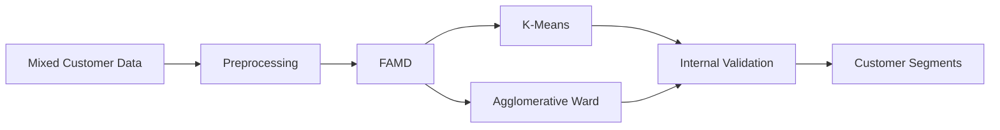
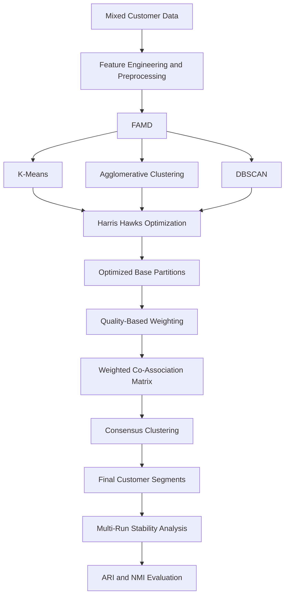

# Research Thesis — Customer Segmentation Using HHO and Ensemble Clustering

## Overview

This directory contains the complete implementation structure associated with my thesis:

> **Improving Customer Segmentation Using Harris Hawks Optimization and Ensemble Clustering**

The research investigates customer segmentation on mixed-type e-commerce data using **unsupervised learning, dimensionality reduction, clustering, metaheuristic optimization, and ensemble clustering**.

To keep the methodological comparison transparent, the implementation is divided into two separate components:

1. **Baseline Article Replication**
2. **Proposed Thesis Method**

The baseline reproduces the reference clustering methodology used in the thesis, while the proposed method extends that framework through **Harris Hawks Optimization (HHO), multiple clustering algorithms, weighted ensemble clustering, consensus clustering, and multi-run stability analysis**.

---

## Repository Structure

```text
7(Research-Thesis)/
│
├── README.md
│
├── 1(Baseline-Article-Replication)/
│   ├── README.md
│   └── Baseline_Article_Replication_FAMD_Clustering.ipynb
│
└── 2(Proposed-Thesis-Method)/
    ├── README.md
    └── Customer_Segmentation_HHO_Ensemble.ipynb
```

---

# 1. Baseline Article Replication

[View the Baseline Article Replication](./1%28Baseline-Article-Replication%29/)

This project contains the clean and reproducible implementation of the **baseline methodology used for comparison in the thesis**.

The baseline pipeline includes:

- Dataset validation and preprocessing
- Percentile-based outlier capping
- Eta correlation-ratio analysis
- Factor Analysis of Mixed Data (FAMD)
- K-Means clustering
- Agglomerative Hierarchical Clustering
- Silhouette Score
- Davies-Bouldin Index
- Calinski-Harabasz Index
- Elbow and dendrogram diagnostics
- Customer-segment profiling
- FAMD dimensionality sensitivity analysis

### Baseline Workflow



The main baseline analysis compares:

```text
k = 3
k = 4
```

For the four-cluster baseline solution, the main internal validation results are:

| Metric | Result |
|---|---:|
| Number of clusters | 4 |
| Silhouette Score | 0.564877 |
| Davies-Bouldin Index | 0.737173 |
| Calinski-Harabasz Index | 3596.45 |

The baseline implementation is maintained separately so that the original comparison framework remains clearly distinguishable from the methodological extensions introduced in the thesis.

---

# 2. Proposed Thesis Method

[View the Proposed Thesis Method](./2%28Proposed-Thesis-Method%29/)

The proposed methodology extends the baseline framework by combining **metaheuristic optimization and ensemble clustering**.

The complete proposed pipeline includes:

- Feature engineering and preprocessing
- Factor Analysis of Mixed Data (FAMD)
- K-Means clustering
- Agglomerative clustering
- DBSCAN
- Harris Hawks Optimization (HHO)
- Clustering hyperparameter optimization
- Quality-based partition weighting
- Weighted ensemble clustering
- Co-association consensus clustering
- Multi-run optimization
- Adjusted Rand Index (ARI)
- Normalized Mutual Information (NMI)
- Stability analysis

### Proposed Workflow



The proposed implementation identifies a final **six-cluster customer structure**.

Main full-data clustering results:

| Metric | Result |
|---|---:|
| Number of clusters | **6** |
| Silhouette Score | **0.7119** |
| Davies-Bouldin Index | **0.4081** |
| Calinski-Harabasz Index | **11588.44** |
| DBSCAN noise ratio | **0%** |

The multi-run consensus analysis also reproduced the same final clustering structure with very high agreement with the main ensemble.

---

## Baseline vs. Proposed Method

| Component | Baseline Article Replication | Proposed Thesis Method |
|---|---|---|
| Mixed-type dimensionality reduction | FAMD | FAMD |
| K-Means | Yes | Yes |
| Agglomerative clustering | Yes | Yes |
| DBSCAN | No | Yes |
| Metaheuristic optimization | No | **HHO** |
| Hyperparameter optimization | Limited baseline configuration | **Joint HHO search** |
| Ensemble clustering | No | **Yes** |
| Partition weighting | No | **Quality-based weighting** |
| Co-association consensus | No | **Yes** |
| Multi-run stability analysis | No | **Yes** |
| ARI / NMI analysis | No | **Yes** |
| Main resulting structure | 4-cluster baseline | 6-cluster proposed solution |

> **Note:** The numerical results above belong to their respective analytical pipelines and experimental configurations. The repository keeps both implementations separate to make the methodological comparison transparent.

---

## Dataset

Both implementations use the publicly available:

**Shopping Trends and Customer Behaviour Dataset**

The dataset contains **3,900 customer records** with numerical and categorical attributes related to customer demographics, purchasing behaviour, and preferences.

The dataset is available from Kaggle:

[Download the Shopping Trends and Customer Behaviour Dataset](https://www.kaggle.com/datasets/sahilislam007/shopping-trends-and-customer-behaviour-dataset)

The dataset itself is not redistributed through this repository.

---

## Research Contribution

The thesis investigates whether customer segmentation can be enhanced by moving beyond a single clustering algorithm and instead combining:

```text
Mixed-Type Data Analysis
        +
Multiple Clustering Algorithms
        +
Metaheuristic Optimization
        +
Weighted Ensemble Clustering
        +
Consensus Clustering
        +
Stability Evaluation
```

The proposed methodology uses **Harris Hawks Optimization** to search clustering parameters and subsequently integrates multiple optimized partitions through a weighted co-association framework.

A multi-run analysis is additionally used to examine whether the discovered segmentation structure remains stable across independent optimization executions.

---

## Research Areas

This work lies at the intersection of:

- Unsupervised Learning
- Customer Segmentation
- Clustering
- Ensemble Clustering
- Metaheuristic Optimization
- Harris Hawks Optimization
- Mixed-Type Data Analysis
- Factor Analysis of Mixed Data
- Consensus Clustering
- Cluster Validation
- Machine Learning
- Data Mining
- Reproducible Research

---

## Navigation

### Baseline Implementation

➡️ [1 — Baseline Article Replication](./1%28Baseline-Article-Replication%29/)

Contains the baseline FAMD, K-Means, and Agglomerative clustering replication used as the reference methodology.

### Proposed Thesis Implementation

➡️ [2 — Proposed Thesis Method](./2%28Proposed-Thesis-Method%29/)

Contains the proposed HHO-optimized weighted ensemble clustering framework and stability analysis.

---

## Thesis Context

**Thesis Title**

> **Improving Customer Segmentation Using Harris Hawks Optimization and Ensemble Clustering**

The two implementations are intentionally separated to clearly distinguish:

```text
What was reproduced from the baseline methodology
                    │
                    ▼
What was extended in the proposed thesis methodology
```

This organization is intended to support **research transparency, reproducibility, and clear methodological comparison**.

---

## Author

**Sina**

Research interests represented by this work include:

**Unsupervised Learning · Clustering · Ensemble Clustering · Metaheuristic Optimization · Machine Learning · Customer Analytics · Data Mining**
