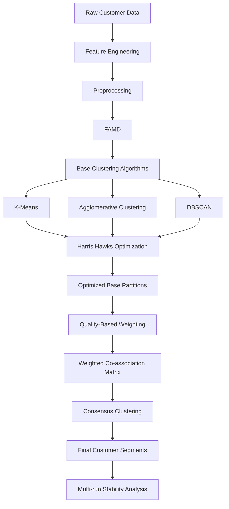

# Customer Segmentation with Harris Hawks Optimization and Weighted Ensemble Clustering

## Overview

This repository contains the cleaned and reproducible implementation of my thesis methodology for **customer segmentation using mixed-type e-commerce data**.

The project investigates how **Harris Hawks Optimization (HHO)** can be combined with multiple clustering algorithms and **weighted ensemble clustering** to identify stable and meaningful customer segments.

The complete methodology integrates:

- Feature engineering and preprocessing
- Factor Analysis of Mixed Data (FAMD)
- K-Means clustering
- Agglomerative clustering
- DBSCAN
- Harris Hawks Optimization (HHO)
- Weighted ensemble clustering
- Co-association consensus clustering
- Multi-run stability analysis using ARI and NMI

---

## Research Objective

The main objective of this project is to improve customer segmentation by combining the complementary behavior of multiple clustering algorithms and optimizing their important parameters using **Harris Hawks Optimization**.

Instead of relying on a single clustering algorithm, the proposed pipeline generates multiple optimized partitions and combines them through a **weighted co-association ensemble approach**.

The final clustering structure is then evaluated in terms of both:

- **Clustering quality**
- **Stability across independent optimization runs**

---

## Methodology

The overall workflow of the project is:



The dataset contains **3,900 customer records** with both numerical and categorical attributes.

Because the dataset contains mixed data types, **Factor Analysis of Mixed Data (FAMD)** is applied to transform the original feature space into **three latent components** before clustering.

---

## Base Clustering Algorithms

Three complementary clustering algorithms are used in the ensemble.

| Algorithm | Clustering Approach |
|---|---|
| **K-Means** | Centroid-based clustering |
| **Agglomerative Clustering** | Hierarchical clustering |
| **DBSCAN** | Density-based clustering |

These algorithms represent different assumptions about the underlying structure of the data.

Using different clustering approaches increases the diversity of the candidate partitions used in the final ensemble.

---

## Harris Hawks Optimization

**Harris Hawks Optimization (HHO)** is used to search for suitable clustering parameters within a joint optimization space.

The HHO decision vector is defined as:

```text
[k, log(eps), minPts, nAgg]
```

where:

| Parameter | Description |
|---|---|
| `k` | Number of K-Means clusters |
| `eps` | DBSCAN neighborhood radius |
| `minPts` | DBSCAN minimum number of samples |
| `nAgg` | Number of Agglomerative clusters |

The implementation also includes additional search mechanisms designed to improve exploration and exploitation during optimization:

- Levy flight
- Mutation
- Local probing
- Diversification
- Restart strategy

The optimization process evaluates clustering solutions using internal validation measures including:

- **Silhouette Score**
- **Davies-Bouldin Index**
- **Calinski-Harabasz Index**

---

## HHO Experimental Configurations

Two HHO configurations are included in the implementation.

### Smoke Run

A smaller configuration used for initial experimentation and validation.

| Parameter | Value |
|---|---:|
| Search sample | 400 observations |
| Independent starts | 20 |
| Population size | 50 |
| Maximum iterations | 60 |

### Full Run

A larger configuration used for the main optimization experiment.

| Parameter | Value |
|---|---:|
| Search sample | 400 observations |
| Independent starts | 30 |
| Population size | 80 |
| Maximum iterations | 160 |

Convergence traces and final fitness values from the independent HHO runs are recorded for analysis and visualization.

---

## Weighted Ensemble Clustering

After optimization, the partitions generated by:

- K-Means
- Agglomerative Clustering
- DBSCAN

are combined using a **weighted co-association matrix**.

Rather than treating every clustering algorithm equally, the ensemble assigns weights according to the quality of the generated partitions.

The weighting procedure uses:

1. Clustering quality evaluation
2. Quality-based weight calculation
3. Softmax normalization
4. Weighted co-association matrix construction
5. Consensus clustering

The final consensus partition is generated using **average-linkage hierarchical clustering**.

Candidate cluster counts from **2 to 12** are evaluated using:

- Silhouette Score
- Davies-Bouldin Index
- Calinski-Harabasz Index

---

## Multi-Run Stability Analysis

Because HHO is a stochastic metaheuristic algorithm, evaluating a single optimization run is not sufficient to assess the robustness of the solution.

To investigate stability, HHO is independently executed across **20 random seeds**.

Each HHO solution generates three optimized clustering partitions:

```text
K-Means-HHO
Agglomerative-HHO
DBSCAN-HHO
```

This process produces up to **60 candidate partitions**.

The partitions are evaluated using both clustering-quality and agreement measures.

### Clustering Quality Metrics

- Silhouette Score
- Davies-Bouldin Index
- Calinski-Harabasz Index

### Stability Metrics

- Adjusted Rand Index (ARI)
- Normalized Mutual Information (NMI)

A weighted multi-run consensus partition is then constructed from the candidate solutions.

The final multi-run solution is compared with the main ensemble to determine whether the discovered customer segmentation structure remains consistent across independent HHO executions.

---

## Main Results

The final clustering structure contains **six customer segments**.

### Final Full-Data Clustering Performance

| Metric | Result |
|---|---:|
| Number of clusters | **6** |
| Silhouette Score | **0.7119** |
| Davies-Bouldin Index | **0.4081** |
| Calinski-Harabasz Index | **11588.44** |
| DBSCAN noise ratio | **0%** |

After HHO optimization, K-Means, Agglomerative Clustering, and DBSCAN produced highly consistent six-cluster partitions.

The multi-run consensus analysis also reproduced the same final clustering structure with very high agreement relative to the main ensemble.

These results indicate that the identified segmentation structure remains stable across independent optimization runs.

---

## Reproducibility

Harris Hawks Optimization is a **stochastic metaheuristic algorithm**.

Therefore, small differences in the final HHO fitness value may occur across:

- Independent executions
- Random seeds
- Software environments
- Refactored or cleaned implementations

The original thesis experiment reported a best HHO fitness value of approximately:

```text
5.771075
```

## Dataset

The experiments use the publicly available:

**Shopping Trends and Customer Behaviour Dataset**

The dataset contains **3,900 customer records** and includes both numerical and categorical customer attributes.

> **Note:** The dataset is not included directly in this repository.

You can download the dataset from Kaggle:

[Download the Shopping Trends and Customer Behaviour Dataset](https://www.kaggle.com/datasets/sahilislam007/shopping-trends-and-customer-behaviour-dataset)

After downloading the dataset, update the dataset path in the notebook before running the implementation.

---

## Dataset

The experiments use the publicly available:

**Shopping Trends and Customer Behaviour Dataset**

The dataset contains **3,900 customer records** and includes both numerical and categorical customer attributes.

> **Note:** The dataset is not included directly in this repository.

Users should download the dataset separately and update the dataset path in the notebook before running the implementation.

---

## How to Run the Project

1. Download the **Shopping Trends and Customer Behaviour Dataset**.
2. Place the dataset in your preferred local directory.
3. Update the dataset path inside the notebook.
4. Install the required Python packages.
5. Run the notebook cells sequentially.

---

## Requirements

The main Python packages used in this project include:

```text
numpy
pandas
matplotlib
scikit-learn
scipy
prince
```

---

## Research Context

This project represents the main implementation developed for my thesis:

> **Improving Customer Segmentation Using Harris Hawks Optimization and Ensemble Clustering**

The work focuses on the intersection of:

**Unsupervised Learning · Clustering · Ensemble Clustering · Metaheuristic Optimization · Customer Segmentation · Mixed-Type Data Analysis**

---

## Author

**Sina**

Research interests include:

- Unsupervised Learning
- Clustering
- Ensemble Clustering
- Metaheuristic Optimization
- Machine Learning
- Data Mining
- Intelligent Decision-Support Applications
